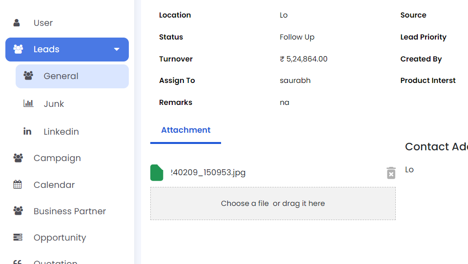

# Todo App

Welcome to the Todo App! This app helps you keep track of your tasks efficiently and effectively.

## Features

- **Add Tasks**: Easily add new tasks with a title and description.
- **Edit Tasks**: Update task details as needed.
- **Delete Tasks**: Remove tasks that are no longer needed.
- **Mark as Complete**: Mark tasks as completed to keep your list organized.
- **Task Prioritization**: Assign priority levels to tasks to manage your workload.
- **Due Dates**: Set due dates to ensure you never miss a deadline.
- **Notifications**: Receive reminders about upcoming tasks.
- **Search Functionality**: Quickly find tasks by searching keywords.
- **User Authentication**: Secure your tasks with user authentication.
- **Offline Support**: Access your tasks even when you’re offline.

## Screenshots

### Home Screen


### Add Task Screen


### Edit Task Screen


### Task List


## Installation

To install and run this application locally, follow these steps:

1. Clone the repository
   ```bash
   git clone https://github.com/yourusername/todo-app.git

2. Open the project in Android Studio.
3. Build and run the app on an emulator or a physical device.
